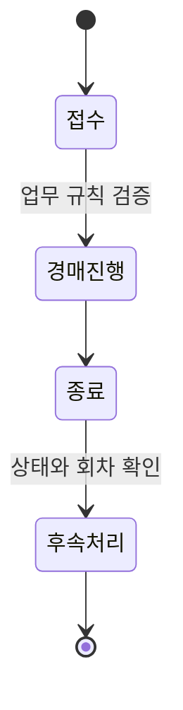

# C2B 경매 서비스 개발

> 기간: 2025.04 ~ 2025.07
> 도메인 모델과 테스트를 기반으로 변화하는 경매 정책에 대응하며 백엔드 전반 개발

핵심 업무 규칙이 확정되지 않은 상태에서 약 2개월 내 최초 출시를 목표로 개발에 착수했습니다. 데이터 구조 설계부터 백엔드 API 개발까지 단독으로 담당했고, 개발과 동시에 기획자·실무자와 실제 업무 흐름을 구체화했습니다.

- **문서로 규칙 조율:** 상품 접수, 경매 진행, 종료 후 처리처럼 상태가 바뀌는 지점을 문서로 정리해 기획과 실제 운영의 차이를 확인했습니다. 논의 결과는 구현 조건과 테스트 사례에 반영했습니다.
- **도메인 책임 분리:** 경매 대상과 진행 회차, 종료 후 전환의 책임을 나눠 정책 변경이 관련 모델 안에서 처리되도록 구성했습니다.
- **테스트로 변경 검증:** 상태와 회차에 따른 후속 처리 가능 여부를 테스트로 검증했습니다. 모델이 크게 바뀔 때는 기존 테스트를 기준으로 누락한 조건을 찾아 보완했습니다.

## 핵심 흐름

문제 해결 흐름을 단순화한 개념도입니다.

핵심 기획이 여러 차례 바뀌는 동안에도 변경 영향을 도메인 모델과 테스트로 확인하며 약 2개월의 최초 출시 목표를 맞췄습니다.

---

[← 포트폴리오](../README.md)
