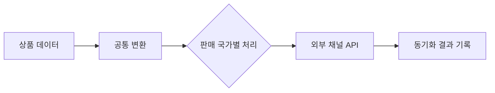

# eBay 상품 연동 자동화 및 고도화

> 기간: 2024.12 ~ 2025.09
> 수기 상품 등록을 일괄 등록에서 다국가 API 동기화로 단계적 자동화

반복적인 수기 등록 때문에 상품 운영 규모를 늘리기 어려웠습니다. 자동화 프로젝트를 제안해 승인받고, 담당자 인터뷰로 실제 작업 흐름과 병목을 확인했습니다.

처음에는 상품 데이터를 추출하고 누락 항목을 보완·후가공해 일괄 등록할 수 있는 흐름을 만들었습니다. 이후 사업 확장에 따라 수기 장부와 외부 채널 사이의 상태 차이, 반복 확인 과정에서 생길 수 있는 오류를 줄이기 위해 API 동기화로 발전시켰습니다.

- **실행 환경 통합:** Java로 개발한 상품 데이터 변환 엔진을 협업 중인 NestJS 서비스로 이관해 운영 지점을 합치고 불필요한 서비스 간 호출을 줄였습니다.
- **변경 범위 분리:** 상품 변환, 국가별 설정, 외부 API 통신, 동기화 진행 상태의 책임을 나눠 국가 추가와 오류 대응이 한 흐름에 얽히지 않도록 개선했습니다.
- **처리량 개선:** 국가별 작업을 독립적으로 실행하고, 외부 API가 지원하는 작업은 묶어서 호출하도록 바꿨습니다.

## 핵심 흐름

문제 해결 흐름을 단순화한 개념도입니다.

로그를 기준으로 전체 상품의 전 국가 연동 시간을 약 24시간에서 약 3시간으로 단축했습니다. 수기 등록에서 출발한 자동화를 다국가 운영 흐름으로 확장해, 상품 운영을 지원했습니다.

---

[← 포트폴리오](../README.md)
