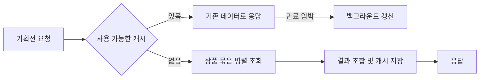

# 기획전 조회 성능 개선

> 기간: 2025.10
>
> Coroutine 병렬화와 Redis 캐시 갱신 개선으로 기획전 응답 지연 해소

Slack의 기획전 응답 지연 알림을 계기로 원인을 조사했습니다. 캐시가 만료된 직후 여러 상품 묶음을 순서대로 조회하면서 대기 시간이 누적되는 병목을 구간별로 측정했습니다.

- **상품 조회 병렬화:** 서로 독립적인 기획전 모듈과 상품 묶음 조회를 Coroutine으로 병렬 실행하고, 완료된 결과를 모아 응답을 구성했습니다.
- **요청 기반 캐시 갱신:** 만료가 가까운 캐시가 조회되면 기존 데이터로 먼저 응답하고 백그라운드에서 새 데이터를 저장하도록 바꿨습니다. 방문이 이어지는 기획전에서 캐시 만료 직후의 긴 대기를 줄이기 위한 방식입니다.

## 캐시 응답과 갱신 경로

캐시가 없을 때의 조회와, 기존 데이터로 응답하면서 갱신하는 경로를 구분한 개념도입니다.

캐시가 없는 조건에서 응답 시간을 약 30초에서 약 2초로 단축했습니다. 배포 후 3~4일간 모니터링했을 때 3초를 넘는 응답이나 같은 지연 알림은 관찰되지 않았습니다.

---

[← 포트폴리오](../README.md)
