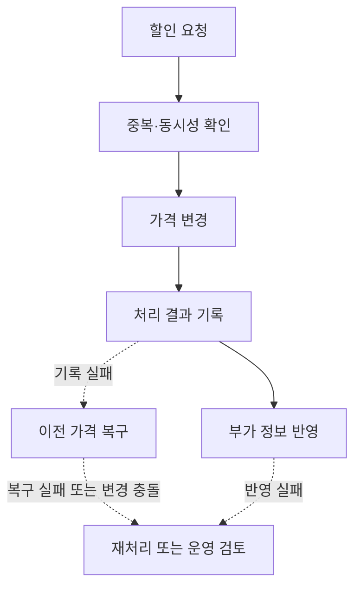

# 한달특가 재구축 및 데이터 정합성 개선

> 기간: 2026.06
> 멱등 처리와 보상·재처리 설계로 서비스 간 정합성을 개선한 한달특가 재구축

기존 한달특가는 특가 등록과 상품 가격 변경 중 일부만 성공하면 데이터가 불일치할 수 있었고, 이를 복구하는 처리가 부족했습니다. 리세일 마이그레이션 당시 기능을 일시 중단했으며, 안정화 후 재개하면서 이러한 정합성 문제를 개선하기 위해 재구축했습니다.

- **중복 할인 방지:** 재요청이나 동시 요청으로 같은 할인이 반복 적용되지 않도록 요청 단위의 멱등 처리와 비관적 락을 적용했습니다. 잠금을 얻은 뒤에도 처리 이력과 할인 가능 조건을 다시 확인하도록 구현했습니다
- **부분 실패 시 가격 정합성 복구:** 연동 서비스의 가격 변경만 성공하고 내부 기록이 실패하면 이전 가격으로 복구하도록 했습니다. 즉시 복구하지 못한 작업은 Outbox에 저장해 재처리하고, 이후 다른 가격 변경이 확인되면 자동 복구를 멈춰 운영자가 검토하도록 했습니다
- **할인과 부가 정보의 복구 분리:** 부가 정보 반영 실패 때문에 이미 적용된 할인까지 취소되지 않도록 복구 경로를 나눴습니다. 할인은 유지하면서 실패한 작업만 Outbox 기반으로 다시 처리하고, 반복 실패는 운영 검토 대상으로 구분했습니다

## 핵심 흐름

문제 해결 흐름을 단순화한 개념도입니다.

---

[← 포트폴리오](../README.md)
