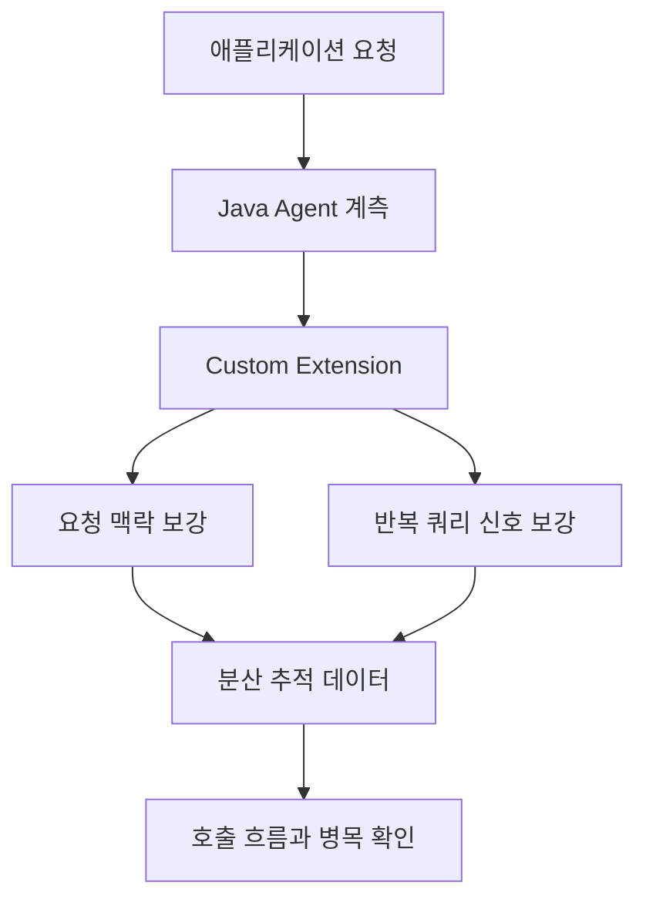

# OpenTelemetry 기반 분산 추적 적용

> 기간: 2026.01
> Java Agent와 Custom Extension으로 레거시 서비스의 APM 적용 제약 해소

분산된 서비스 환경에서는 한 요청의 호출 흐름과 반복 쿼리를 함께 보기 어려웠습니다. 기존 플러그인 방식은 운영 중인 프레임워크 버전과 맞지 않아 적용 범위가 제한됐습니다.

OpenTelemetry Java Agent 기반으로 전환해 프레임워크 버전 업그레이드 없이 분산 추적을 적용했습니다. Custom Extension으로 업무 요청의 식별 맥락과 쿼리 실행 정보를 추적 데이터에 보강해, 요청 단위 호출 흐름과 N+1 패턴을 함께 확인할 수 있도록 했습니다.

## 핵심 흐름

문제 해결 흐름을 단순화한 개념도입니다.

---

[← 포트폴리오](../README.md)
