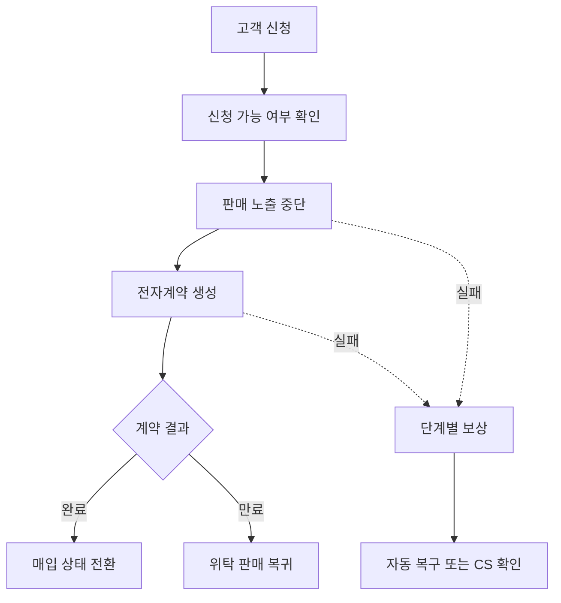

# 매입전환

> 기간: 2026.07 ~ 2026.08
> 고객이 직접 신청할 수 있는 마이페이지 매입전환 경로 구축

고객이 CS를 거치지 않고 마이페이지에서 직접 매입전환을 신청하는 신규 판매 경로를 구축했습니다. 요구사항 구체화부터 백엔드 설계·구현·배포를 담당했고, 고객 화면은 프론트엔드 개발자와 협업했습니다.

- **지연·중복 이벤트 방어:** 계약 식별자와 현재 신청 상태를 조건으로 갱신(CAS)해, 이전 계약의 늦은 이벤트가 새 신청에 영향을 주거나 후속 처리가 중복 실행될 위험을 줄였습니다.
- **Saga 기반 보상 처리:** 판매 노출 중단, 전자계약 생성, 상태 전환을 단계별로 처리하고, 실패한 단계에 따라 계약 취소나 판매 노출 복구를 시도하도록 구성했습니다
- **보상 실패 시 운영 복구:** 자동 복구마저 실패하면 재신청을 제한하고, CS가 연동 시스템의 상태를 확인한 뒤 사유를 남겨 제한을 해제하도록 했습니다.
- **상태 판정 통합 및 검증:** 완료와 만료 처리에 중복돼 있던 판정 규칙을 한곳으로 모았습니다. 지연·중복 이벤트와 복구 실패 시의 주요 전환을 테스트로 검증했습니다

## 핵심 흐름

문제 해결 흐름을 단순화한 개념도입니다.

---

[← 포트폴리오](../README.md)
