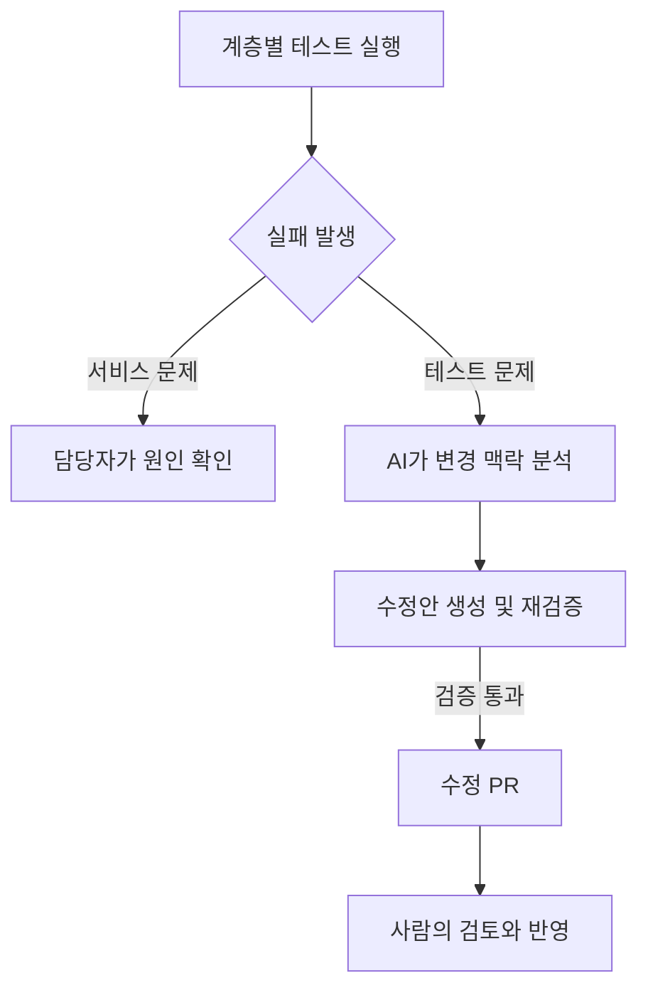

# AI 기반 E2E 테스트 유지보수 자동화

> 기간: 2026.07 ~ 현재
> 테스트 실패 분석부터 수정 PR 생성까지 자동화하고, 사람이 검토하는 운영 체계 구축

기존 자동화 테스트는 하드코딩된 셀렉터에 의존해 UI 변경마다 테스트 코드 수정이 필요했고, 유지보수 비용이 커지면서 핵심 흐름을 지속적으로 검증하기 어려웠습니다.

커머스의 핵심 구매 흐름을 검증하는 최소한의 안전장치가 필요하다고 판단해, AI를 활용한 테스트 유지보수 자동화를 추진했습니다.

- **계층별 검증 분리:** 서비스 응답·API 동작·브라우저 사용자 흐름을 각각 검증해, 실패 구간을 좁히고 UI 테스트 오류와 서비스 장애를 구분하도록 구성
- **Self-Healing Pipeline:** AI가 프론트엔드 소스 코드를 바탕으로 실패 원인을 분석하고, 테스트 수정·재검증 후 PR을 생성하도록 자동화. 사람이 변경 내용을 검토한 뒤 반영

테스트 오류의 원인 분석부터 수정·재검증까지 자동화해, 엔지니어가 수정 PR 검토를 중심으로 테스트를 유지보수할 수 있는 체계를 구축했습니다.

## 핵심 흐름

문제 해결 흐름을 단순화한 개념도입니다.

---

[← 포트폴리오](../README.md)
