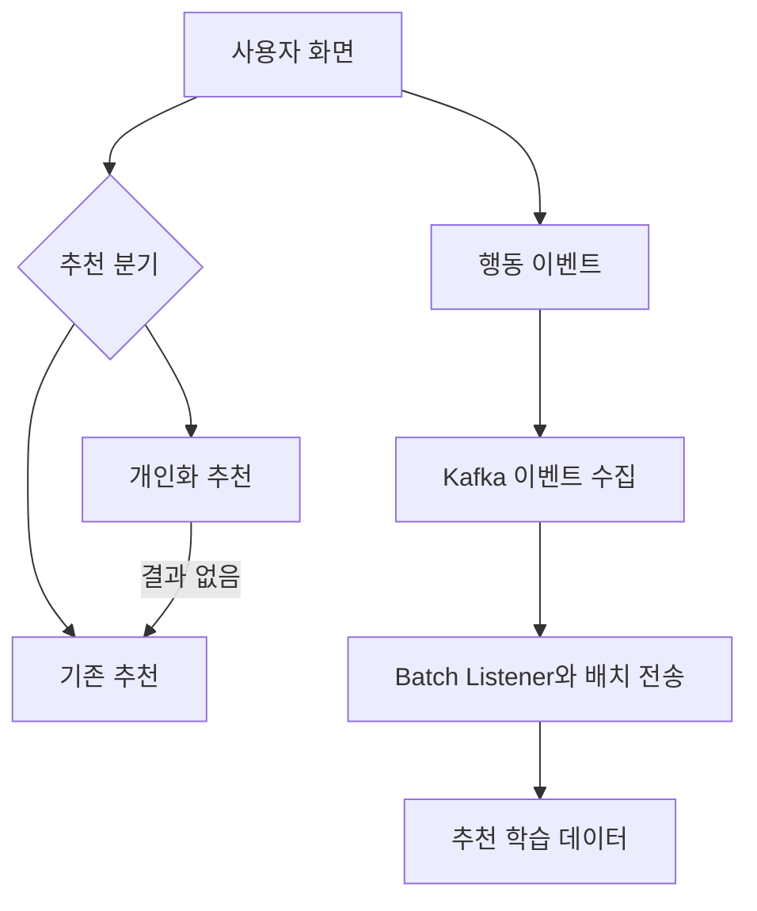

# 개인화 추천 연동 및 이벤트 처리 개선

> 기간: 2024.07 ~ 2025.03
> 개인화 추천 도입과 대규모 사용자 행동 이벤트 파이프라인 구축·개선

개인화 추천 PoC를 이어받아 주요 화면의 추천 API 연동과 A/B 테스트 적용, 추천 모델 학습에 필요한 사용자 행동 이벤트 전송을 담당했습니다.

- **추천 API 연동:** 기존 추천과 외부 개인화 추천을 A/B 분기로 연결하고, 개인화 추천 결과가 없으면 기존 로직으로 응답하도록 구성.
- **이벤트 처리 개선:** Kafka 기반 사용자 행동 이벤트 파이프라인을 구축. 건별 동기 API 호출로 이벤트가 적체되자, Kafka Batch Listener와 배치 API 호출로 전환.

주요 화면에 개인화 추천을 적용하고 기존 추천과 비교할 수 있는 환경을 마련했습니다. 배치 처리로 전송 적체를 줄여 추천 학습 데이터의 최신성을 회복했습니다.

## 핵심 흐름

문제 해결 흐름을 단순화한 개념도입니다.

---

[← 포트폴리오](../README.md)
