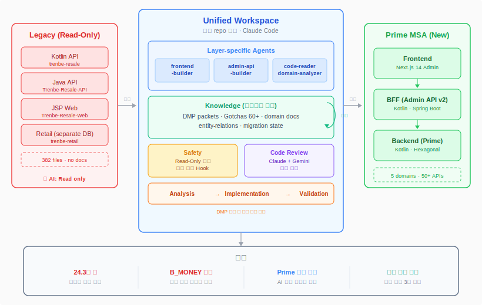

# 리세일 3개 레거시 시스템 통합 마이그레이션

> 2025.12 ~ 진행 중 · 마이그레이션 설계 및 주도

`Kotlin` `Spring Boot 3.x` `Next.js 14` `TypeScript 5` `JPA/Hibernate` `MySQL` `Claude Code`

**Frontend(Admin) + BFF + Backend 3계층 전면 마이그레이션 주도. 도메인 전문가 부재 상황에서 AI를 코드 기반 도메인 전문가로 육성하고, 약점(프론트엔드)은 전용 에이전트·규칙으로 보완. 데이터 교차 검증으로 24.3억 원 불일치와 고객 자산 미적립 버그를 사전 발견·수정**

 

## 상황

- 리세일(중고 위탁 판매) 서비스가 3개 독립 시스템(Kotlin/Java/JSP)으로 분산 운영. 양쪽 도메인을 모두 파악하는 인원 부재
- Frontend(Next.js admin) + BFF(Admin API v2) + Backend(Prime) **3계층 전면 마이그레이션** — 단순 백엔드 교체가 아니라 화면부터 DB까지 전부 바뀌는 작업
- 감정·상품·배송·반환·정산 5개 도메인, 382개 파일에 비즈니스 규칙이 암묵적으로만 존재. 사양 문서 없음
- 프론트엔드는 전문 영역이 아닌 상태에서 full-stack 마이그레이션을 주도해야 하는 상황

 

## 왜 AI를 썼는가

- 감정 도메인 하나를 수동 분석하는 데 2일 소요. 5개 도메인 전체를 같은 방식으로는 일정 내 불가능
- 도메인 전문가를 채용할 수 없는 상황 → **AI를 코드 기반 도메인 전문가로 육성하기로 판단**
- 프론트엔드 역량 부족 → 실수를 구조적으로 방지할 수 있는 체계가 필요
- AI로 별도 서비스(trenbe-retail, 별도 DB)를 분석한 결과, 사입 관련 메뉴 3개는 신규 구현 불필요 판단 — ETL 후 PURCHASE type 흡수로 대체. **구현해야 할 일뿐 아니라 안 해도 되는 일을 찾는 데에도 활용**

 

## 어떻게 활용했는가

### 1) 모든 repo를 하나의 워크스페이스에 통합

- trenbe-resale-prime(Backend), trenbe-resale(BFF), trenbe-frontend(Admin) 등 전체 repo를 한 디렉토리에 모아 AI가 3계층 코드를 동시에 참조할 수 있는 환경 구성
- 레거시 코드는 Read-Only로 잠금 — AI가 분석은 하되 수정은 불가하도록 권한 분리

### 2) 작업할 때마다 도메인 지식 축적

- 코드 분석 결과를 도메인별로 저장. 세션이 거듭될수록 AI가 도메인 컨텍스트를 더 정확하게 이해
- 도메인별 Domain Migration Packet(DMP) 생성 — enum 매핑, API 흐름, 엣지 케이스를 단일 문서로 압축. 이 패킷이 완성되기 전에는 해당 도메인 구현 진입 불가
- 60개 이상의 Gotcha(주의사항)가 세션 간 누적되어, 같은 실수를 반복하지 않는 구조

### 3) 약점(프론트엔드) 보완을 위한 전용 에이전트·규칙 설계

- frontend-builder 에이전트: Next.js 컨벤션(상대 경로 필수, API 호출 패턴, 공통 컴포넌트 사용)을 강제하여 프론트엔드 실수 구조적 방지
- admin-api-builder 에이전트: BFF 계층에서 v1(레거시)은 수정 불가, v2(Prime 프록시)만 Write 가능하도록 제한
- 계층별 빌드 검증 Hook — 프론트엔드 파일 수정 시 lint, BFF 파일 수정 시 gradlew build 자동 리마인드

### 4) 멀티 AI 코드 리뷰로 1인 개발 품질 보완

- Claude + Gemini 병렬 리뷰 — Claude는 로직 흐름·도메인 정합성, Gemini는 타입·명명 규칙 오류에 강점. 교차 검증으로 단일 리뷰어 한계 보완
- 이 과정에서 Prime 코드 기존 버그 다수 발견: `@SQLDelete` 테이블명 오타, 위약금 30,000원 하드코딩, `appraisalResultPrice` upsert 누락, 배치 상태값 불일치(`COMPLETE` vs `COMPLETED`) 등

### 5) 금융성 데이터에서의 AI 역할 분리

- AI가 검증 SQL을 설계하고, 실행은 사람이 직접 수행 — 잘못된 쿼리로 정산 데이터가 오염되는 리스크 차단
- 비즈니스 팀과 CSV 교차 검증 병행

 

## 성과

- **24.3억 원** 규모 정산 불일치 사전 발견·수정 (Legacy↔Prime 간 환율 적용 시점·반올림 로직 차이)
- **B_MONEY 결제 타입 미구현** 사전 발견 — 마이그레이션 후 특정 고객 자산 미적립으로 이어질 Critical 버그
- DDL↔JPA 48개 테이블 전수 검증, 20개 불일치 수정
- 5개 도메인 지식 문서를 팀 공유 자산으로 정착
- QA 인력 부재 환경에서 4개 비즈니스 경로(QUICK 위탁/셔플/사입/반환) E2E 테스트 시나리오를 AI와 함께 설계·구현
- **생산성**: 사입 메뉴 3개 구현 불필요 판단으로 작업 범위 축소. DMP 도입으로 세션 간 컨텍스트 복구 반나절 → 즉시 재개

 

## 한계와 대응

- AI가 유사 컬럼명(`purchase_price` vs `purchased_price`)을 같은 필드로 오매핑 → 이후 DDL 기준 최종 검증 프로세스 추가. 코드 정적 분석만으로 확정할 수 없는 enum 값은 Production DB 직접 실측으로 검증 (`shuffle.status = COMPLETE` — 코드에는 `COMPLETED`로 되어 있었음)
- 정적 분석으로는 런타임 분기(리플렉션, 동적 디스패치) 추론 불가 → API 호출 로그 기반 보완
- AI는 트레이드오프를 나열할 수 있지만 최종 의사결정은 사람이 해야 한다 — GoodsFlow 연동 위치 결정 시 AI 분석을 참고하되 도메인 응집도·트랜잭션 보장 기준으로 직접 판단
