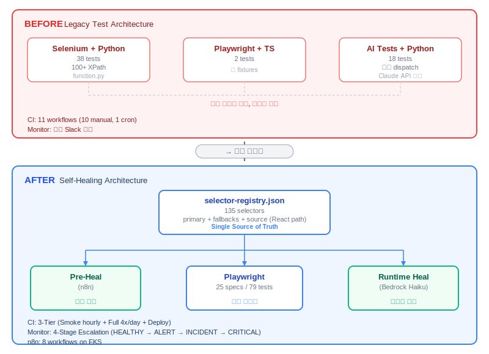

# E2E 테스트 자동화 시스템 재설계 — AI 기반 셀렉터 자가 복구

> 2026.02 ~ 2026.03 · 1인 설계/구축

`Playwright` `TypeScript 5.8` `AWS Bedrock (Claude Haiku)` `n8n` `GitHub Actions`

**QA 부재로 방치된 E2E 테스트를 자발적으로 맡아, AI 셀렉터 자가 복구 시스템을 설계·운영까지 완성**

 

## 왜 이 일을 맡았는가

- QA 담당자 퇴사 후 E2E 테스트가 점진적으로 깨지며 사실상 미가동 상태
- 주문·결제·배송 등 핵심 플로우 검증이 중단되면서, 장애가 고객 리포트로 먼저 들어오는 상황 반복
- 서비스 안정성이 계속 흔들리는 상황에서 자발적으로 재구축에 착수
- data-testid 전수 부착이 가장 안정적인 해결책이나, 수천 개 컴포넌트 소급 적용은 현실적으로 어려운 상황
- 프론트엔드 변경 없이 독립적으로 해결 가능한 방법을 탐색하기 시작

 

## 문제 — 셀렉터가 코드 변경 없이도 깨짐

- WebApp이 React + Styled-Components 기반 → 빌드마다 CSS 클래스 해시가 변경됨
- 레거시 XPath 셀렉터(예: `Dropdown__DropdownTitle-yblcrf-1 eyErnr`)가 코드 수정 없이도 파손
- 3주간 Slack 알림 로그 집계 결과, UI 배포 시 전체 테스트 케이스의 약 30%가 셀렉터 파손으로 실패
- 복구하려면 38개 파일에 분산된 100+ XPath를 수동 업데이트해야 했고, 보통 반나절 소요
- 기존에 Python + Claude API 기반 self-healing POC(18 tests)가 존재 — 개념은 검증되었으나 별도 레이어로 분리되어 전체 테스트 적용 불가

 

## 왜 Self-Healing이었는가

- 처음에는 n8n + Playwright + AI로 테스트 자체를 자동 생성·실행하는 구조를 구상
- 두 가지 이유로 방향을 전환함
  - **비용**: AI가 매 테스트마다 페이지를 분석하면 토큰 비용이 무시할 수 없는 수준
  - **신뢰성**: 원천 소스(정답)가 없는 상태에서 AI가 판단하는 테스트는 실질적 검증이 아님
- AI의 역할을 "테스트 자체"가 아닌 **"깨진 셀렉터 복구"로 한정**하는 것이 핵심 판단
- 테스트 로직은 사람이 작성하고, AI는 셀렉터 파손이라는 명확하고 검증 가능한 문제만 처리 → Self-Healing 파이프라인의 출발점

 

## 변경 후 테스트 아키텍처

- **n8n + GitHub Actions Self-Healing Test** — 3-Tier 스케줄(매시간 Smoke + 4x/일 Full + 배포 연동) + 2-Layer AI Self-Healing(Pre-Heal + Runtime Heal)
- **n8n API Test** — 28개 엔드포인트, 30분~4시간 주기 독립 모니터링

 

## Self-Healing 아키텍처 요약

- 135개 셀렉터를 단일 JSON(selector-registry.json)으로 중앙 관리 — primary + fallbacks + source(React 컴포넌트 경로) 구조
- 테스트 실행 시 primary → fallbacks 순서로 시도, 모두 실패하면 AWS Bedrock Claude Haiku가 React 소스 + 페이지 HTML을 분석하여 대체 셀렉터를 자동 생성·검증·반영 (Runtime Heal)
- WebApp 배포 시 n8n이 변경 감지 → 영향받는 셀렉터를 사전에 AI로 수정 (Pre-Heal)
- 3-Tier 스케줄(매시간 Smoke + 4x/일 Full + 배포 연동) + 4-Stage Escalation으로 모니터링 자동화

 

## AI 도구 활용 — Claude Code로 1인 구축

QA 경험이 없는 백엔드 개발자 1명이 이 시스템을 2~3주 만에 구축할 수 있었던 건, Claude Code를 단순 코드 생성이 아닌 **프로젝트 전 과정의 협업 도구**로 활용했기 때문임.

### Claude Code 활용 방식

- **레거시 분석**: 3개 프레임워크(Selenium/Playwright/Python AI)의 코드를 Claude Code에 넣고 도메인별 테스트 커버리지 파악, 마이그레이션 전략 수립
- **아키텍처 설계**: Self-Healing 모듈 구조를 Claude Code와의 대화를 통해 설계 → 구현 반복. "이렇게 하면 어떤 문제가 생기는가"를 계속 검증하면서 구조를 잡아감
- **새 도구 학습·적용**: n8n, GitHub Actions, Escalation State Machine 등 처음 다루는 도구를 Claude Code로 빠르게 학습하고 바로 적용
- **프로젝트 컨텍스트 설정**: CLAUDE.md에 프로젝트 구조·핵심 규칙·실행 명령어를 정리하여 Claude Code가 프로젝트를 이해한 상태에서 대화가 시작되도록 설정. 매번 맥락을 설명할 필요 없이 바로 작업에 진입 가능
- **문서화**: CONVENTIONS.md, ARCHITECTURE.md 등 1,200+ LOC 문서를 AI 보조로 작성하여 프로젝트 유지보수성 확보

### 팀 생산성 — Context-Aware Rule 설계

- QA 없이 시스템을 지속하려면 다른 개발자도 테스트를 작성할 수 있어야 함
- 문제: 컨벤션이 방대 — 137개 셀렉터 키, 7개 Custom Fixture, 5개 안티패턴 등
- Claude Code(`.claude/rules/`)에 glob 기반 context-aware rule을 설계하고, 사내 지원 도구인 Cursor(`.cursor/rules/`)에도 동일한 규칙을 적용
  - `src/cases/*.spec.ts` 편집 시 → 셀렉터 키 전체 목록, fixture 패턴, 안티패턴 자동 로딩
  - `selector-registry.json` 편집 시 → 등록 규칙, 네이밍 컨벤션 자동 로딩
  - 총 5개 파일 패턴에 각각 다른 컨텍스트 매핑
- 어떤 AI 도구를 사용하든 파일을 열면 해당 파일에 필요한 컨텍스트가 자동으로 주입되는 구조

 

## 한계 및 향후 방향

- data-testid가 전면 부착되면 Self-Healing 자체가 불필요해짐
- 이 시스템은 프론트엔드 팀 리소스 제약에 대한 기술적 우회

 

## Results

| 지표 | Before | After |
|:-----|:-------|:------|
| 프레임워크 | 3개 혼재 (Selenium/PW/Python) | Playwright + TypeScript 단일 |
| 셀렉터 복구 | 수동, 보통 반나절 | AI 자동 복구 (성공률 83%, 4주간 23건 중 19건). 실패 4건은 DOM 구조 자체 변경 케이스로 수동 처리 |
| 테스트 시나리오 | 58개 산재 | 80개 (25 specs, 도메인별 분류) |
| CI 자동화 | cron 1개 | 3-Tier (매시간 Smoke + 4x/일 Full + 배포 연동) |
| 모니터링 | 단순 Slack 알림 | n8n 8개 워크플로우 + 4-Stage Escalation |
